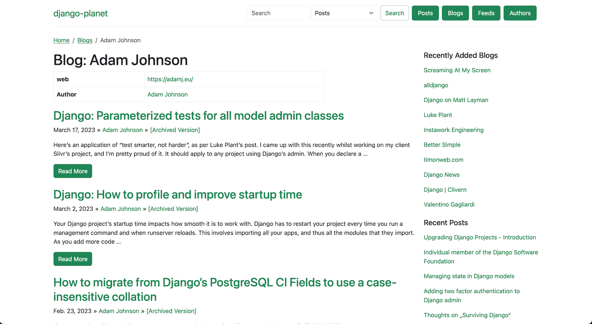
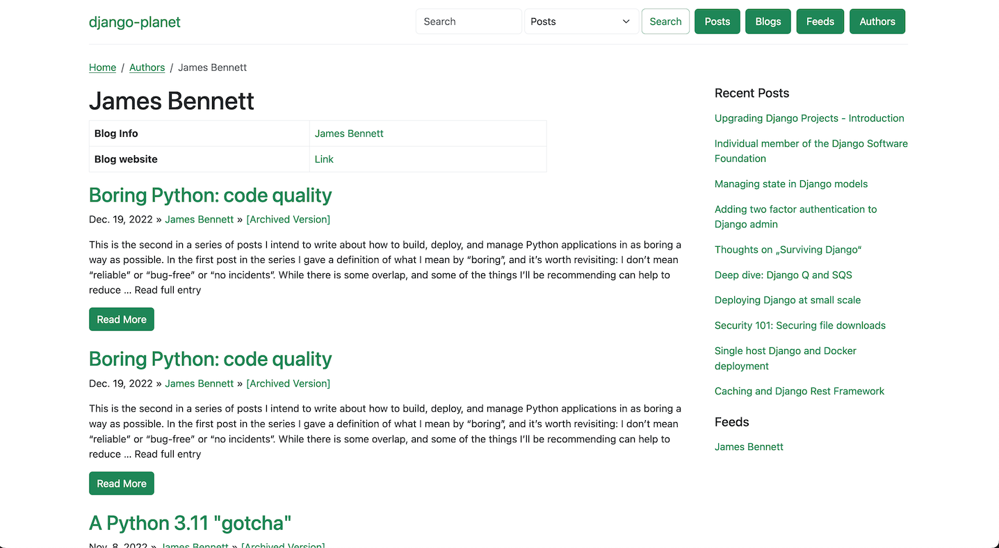

# Demo & Screenshots

## Live Demo

A live instance of django-planet is running at **[django-planet.matagus.dev](https://django-planet.matagus.dev/)**.

## Screenshots

### Post List


### Blog View


### Author View


## Example Project

The repository includes a fully configured example project in the `project/` directory. It uses the same setup as the live demo.

### Running Locally

```bash
# Clone the repository
git clone https://github.com/matagus/django-planet.git
cd django-planet

# Run migrations
hatch run project:migrate

# Start the development server
hatch run project:runserver
```

Then open [http://localhost:8000](http://localhost:8000) in your browser.

You can add feeds via the admin or the management command:

```bash
hatch run project:shell
# or
python manage.py planet_add_feed https://example.com/feed.xml --settings project.project.settings
```
