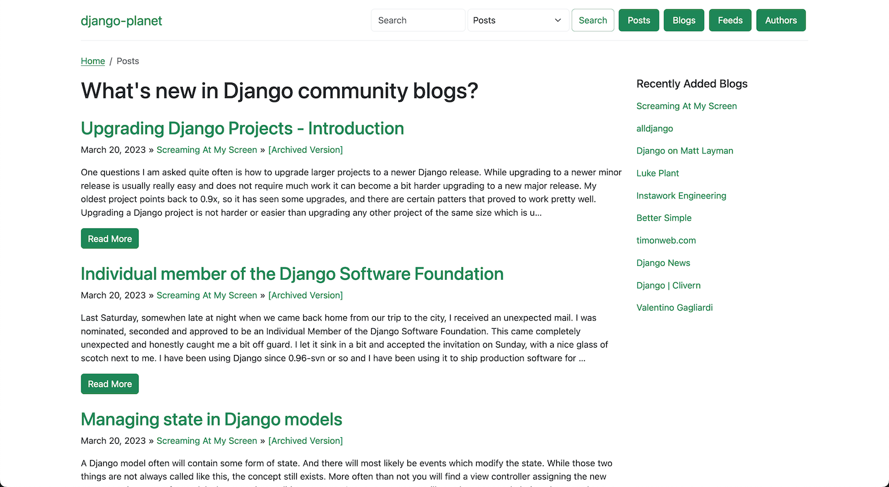

# django-planet

**A reusable Django app for building RSS/Atom feed aggregator websites (aka "Planet" sites).**


[](https://pypi.python.org/pypi/django-planet)

[](https://codecov.io/gh/matagus/django-planet)
[](https://opensource.org/licenses/BSD-3-Clause)

Django-planet makes it easy to create a planet-style feed aggregator. Collect posts from multiple blogs and websites, store them in your database, and display them with built-in views and templates — or build your own custom front-end.



## Features

- **RSS and Atom feed parsing** — Supports both RSS and Atom feed formats via feedparser
- **Automatic feed updates** — Management commands to add feeds and update all feeds
- **Blog, Feed, Post, and Author models** — Complete data model with relationships
- **Built-in views and templates** — Ready-to-use views for blogs, feeds, posts, and authors
- **Django admin integration** — Manage all content through Django's admin interface, including an "Add Feed by URL" workflow
- **Search functionality** — Built-in search across posts, blogs, feeds, and authors
- **SEO-friendly URLs** — Slugified URLs with automatic redirects
- **Custom managers** — Chainable QuerySet methods for filtering by blog, feed, author
- **Template tags** — Custom template tags and filters for common operations
- **Pagination support** — Uses django-pagination-py3 for easy pagination
- **Post filtering** — Configurable filter backends to accept only relevant posts
- **Content archiving** — Optionally fetch and store the full original content of posts

## Quick Install

```bash
pip install django-planet
```

```python
INSTALLED_APPS = [
    # ...
    "planet",
    "pagination",
]

MIDDLEWARE = [
    # ...
    "pagination.middleware.PaginationMiddleware",
]
```

```bash
python manage.py migrate
```

See the [Installation](installation.md) guide for full setup instructions.

## Next Steps

- [Installation & Configuration](installation.md) — Full setup guide
- [Usage](usage.md) — Adding feeds, updating, views, and search
- [Configuration Reference](configuration.md) — All settings, filter backends, and logging
- [Demo & Screenshots](demo.md) — Live demo and example project
